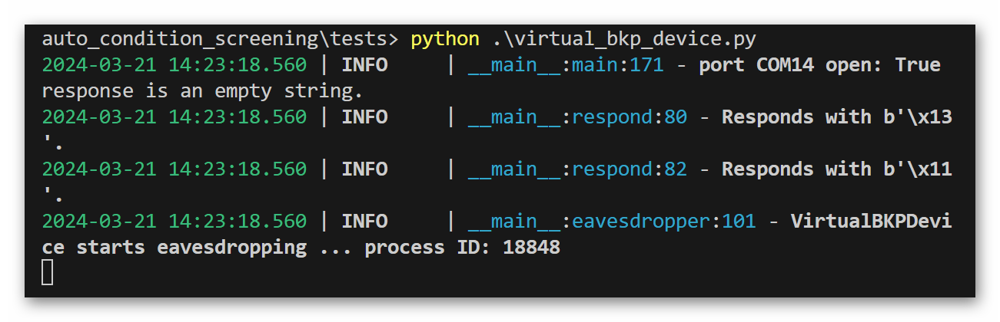
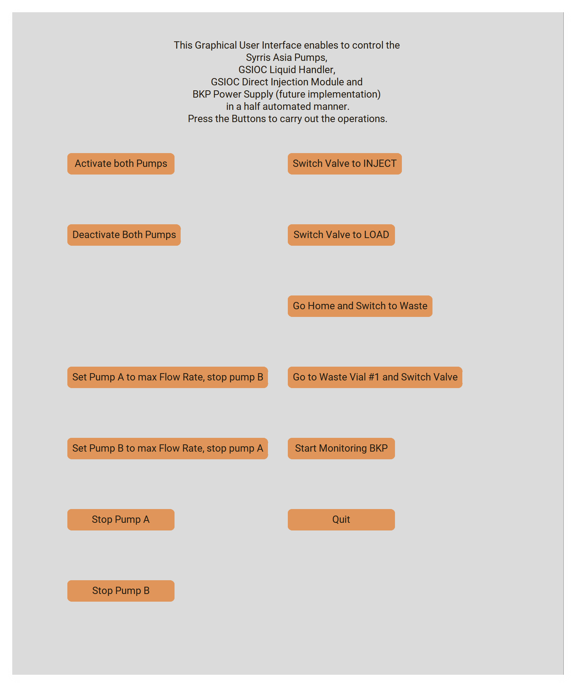

# auto_condition_screening
Python script for automated screening of electrochemical reaction conditions, leveraging Gilson Equipment, Syrris Asia pumps, and a BK Precision Power Source. Communication occurs via OPC-UA, RS-232, and GSIOC protocols.

This script is tailored for automating experimental procedures within a laboratory setting. It encompasses a variety of functionalities, including liquid handling, syringe pumping, data monitoring, and user interaction. Additionally, it provides features for initiating watchdog processes and a graphical user interface (GUI). The primary execution orchestrates the automation process, facilitating remote data retrieval and flexible experimentation. Overall, this script serves as a comprehensive tool for optimizing laboratory workflows and conducting experiments efficiently.

# Introduction
Get the source code [here](https://github.com/fungos34/auto_condition_screening).

Clone this repository to your local machine.

## Quick Start
from the root directory "auto_condition_screening/" run the following commands
```
pip install -r requirements.txt
python ./run.py
```
The system will prompt you 
```
starting position change? (y/n):
```
answering with "y" will start up the GUI for direct device interacitons.
answering with "n" will lead to another prompt
```
starting experiments (further settings are queried afterwards)? (y/n):
```
answering with "n" exits the script.
answering with "y" leads to the next prompt
```
from which experiment number do you want to start? (integer number)
```
provide an integer number to select the experiment to start with. The first experiment is number 1 (not 0). The last prompt will appear.
```
Do you want to carry out the initialisation procedure including filling the reactor? (y/n)
```
answering with "y" will fill the pumps and the system (reactor, tubings, etc.) with the prepared chemicals.
answering with "n" will skip this step and just start with the  experimental procedures.

## Flow Diagram
The experimental procedure consists of several procedural steps, some of which repeat themselves with different set parameters to vary the conditions between experiments. Consequently, this script can be utilized to establish a broad spectrum of experimental parameters, including current, cut-off voltage, flow rate for each pump, rinsing procedures, and collection vials. The following procedure is carried out by default during a typical run.


## Experimental Parameters
The possibility to set all experimental parameters gives you full flexibility to modify the experiments to your specific needs.

Therefore before running the script, the experimental parameters need to be set properly to your specific use case.
Therefore open the run.py file.

For Running experiments be sure to set and specify the ports properly.
```
TESTING_ACTIVE = False
```
Also be sure to set the proper endpoints for your ports and the OPC-UA Server
```
PORT1   = 'COM3'    #port for GX-241 liquid handler
PORT2   = 'COM4'    #port for BK Precision 1739
OPC_UA_SERVER_URL = "opc.tcp://127.0.0.1:36090/freeopcua/server/" 
```
(NOTE: The OPC_UA_SERVER_URL parameter has to be set for the GUI separately. Open therefore the "basic_gui.py" file and set this parameter there as well.)

The residual parameters can be set as demanded for the experiments.
One example to conduct three experiments in a row:
```
CURRENTS = [2.5, 2.7, 3.7]
CHARGE_VALUES = [2.5, 2.8, 2.5]
```
the residual parameters will be calculated automatically.
It is also possible to set other parameters, as long as they are not in conflict with each other.
For detailes see the Module Description below.
NOTE: all parameters have to be inputted as a list of parameters. the first of them is always specifying the first experiment, and so forth.

## Logging

Logging throughout automated chemical experiments is important for several reasons. Logging allows for the collection of detailed records of experimental parameters, reactions, and outcomes. This ensures the integrity of the experimental data, enabling researchers to analyze results accurately and reproduce experiments if necessary. By logging every step of the experiment, researchers can monitor the process in real-time and identify any deviations or anomalies promptly. This facilitates quality control and troubleshooting, ensuring that experiments proceed as planned and reducing the risk of errors or failures. Comprehensive logging provides a documented history of the experiment, including procedures, conditions, and observations. This documentation is essential for reproducibility, enabling other researchers to replicate the experiment and verify the results independently. Logged data can be analyzed to identify patterns, trends, and correlations that may not be apparent during the experiment. This analysis can help researchers optimize experimental conditions, refine protocols, and improve the efficiency and effectiveness of future experiments. In regulated environments such as pharmaceutical research or chemical manufacturing, logging is necessary to comply with industry standards and regulations. Detailed logs ensure traceability and accountability, demonstrating adherence to regulatory requirements and facilitating audits or inspections. 

In summary, logging throughout automated chemical experiments is essential for maintaining data integrity, ensuring quality control, documenting procedures, enabling reproducibility, facilitating analysis and optimization, and complying with regulatory standards. By capturing detailed records of experimental processes and outcomes, logging enhances the reliability, transparency, and rigor of scientific research in the field of chemistry.

### Logging Sinks
For reproducibility all the communication between the devices is monitored and stored in a file located at 
"auto_condition_screening/logs/general.log"

For reliability of the current and voltage values of the power source are monitored throughout the whole process separately in a file at the location 
"auto_condition_screening/logs/monitoring.log"

Furthermore the watchdog maintains its own file at the location. This monitores process crash during the conduction of the experiments. Please note, that if the process has been restarted all the other loggings will be written to this file too.
"auto_condition_screening/logs/watchdog.log"

## Testing Mode utilizing Virtual Devices

Testing with virtual devices offers several advantages in the context of automated chemical experiments.
Virtual devices eliminate the need for physical hardware, saving costs associated with purchasing and maintaining laboratory equipment. This is particularly beneficial for researchers with budget constraints or those exploring experimental setups before investing in actual devices. Virtual devices provide flexibility to simulate various experimental conditions and scenarios without constraints imposed by physical limitations. Researchers can easily scale up or modify experiments virtually, allowing for rapid prototyping and iteration. Virtual devices are accessible from any location with an internet connection, enabling remote experimentation and collaboration. Researchers can conduct experiments, share results, and collaborate with colleagues worldwide without being confined to a specific laboratory. Testing with virtual devices minimizes the risk of accidents, equipment damage, or exposure to hazardous substances associated with physical experimentation. Researchers can explore experimental setups and parameters safely in a virtual environment before conducting experiments in the laboratory. Virtual experimentation enables rapid iteration and testing of hypotheses without waiting for physical setup or execution. Researchers can streamline the experimental process, accelerate data collection, and expedite the overall research timeline. Virtual devices facilitate debugging and validation of automated processes by providing detailed feedback and error logs. Researchers can identify and address issues more efficiently, ensuring the reliability and robustness of automated systems before deployment in the laboratory. Virtual devices serve as valuable educational tools for training students and researchers in experimental techniques and laboratory procedures. They offer a risk-free environment for hands-on learning and skill development in a wide range of scientific disciplines.

Overall, testing with virtual devices offers numerous advantages, including cost-effectiveness, flexibility, accessibility, risk reduction, time efficiency, debugging capabilities, and educational benefits. Integrating virtual experimentation into the research workflow enhances productivity, innovation, and collaboration in the field of automated chemical experiments.

### Running Virtual Devices

Running virtual devices mimics the response behaviour of real devices within the setup.
The shipped virtual devices mimic the behaviour of 

Power Supply: 'B+K PRECISION 1739 Revision 1.3'
Syrringe Pump (continuous): 'Syrris Asia'
Liquid Handler: 'GSIOC Liquid Handler, GX-241 II'
Direct Injection Module: 'GSIOC Direct Injection Module, GX D Inject'
Syrringe Pump (discontinuous): 'GSIOC Syrringe Pump, VERITY 4020'

To start them open a new commandline window (on WINDOWS: press "Windows Key" and type "cmd", press "Enter") change directory to your root directory and "auto_condition_screening/tests/". From here, run the following command.
```
python ./virtual_bkp_device.py      # alternatively run "virtual_gsioc_device.py" or "virtual_syrrisasia_device.py"
``` 



You can change the port on which these virtual devices are listening within the respective files.

## Plotting Data

Visualizing data in a 4D plot can be particularly helpful in certain scenarios. It allows for the representation of three-dimensional data (e.g., x, y, z coordinates) along with an additional dimension (e.g., color or size) to convey more information. This can provide insights into complex datasets where understanding relationships between multiple variables is crucial. For instance, in the context of automated chemical experiments, a 4D plot could depict variations in reaction conditions over time (the fourth dimension) in addition to the spatial coordinates and another property of interest. Such visualization aids in identifying patterns, trends, and correlations that might not be apparent from traditional 2D or 3D plots, thereby enhancing the analysis and decision-making process.

For data visualization, a helper module has been implemented. To utilize it, navigate to the directory "auto_condition_screening/helper/". In the file "stem4dplot.py", you can utilize the class Stem4DPlot() to plot your data.

practical example:
```
Stem4DPlot(
    [1,2,3,4,5,6,7,8,9,'X-Axis'],
    [1,2,3,4,5,6,7,8,9,'Y-Axis'],
    [1,2,3,4,5,6,7,8,9,'Z-Axis'],
    [1,2,4,8,9,8,4,2,1,'Color-Axis'],
    color_code='none',
    reverse_colors=False,
    lower_colorscale_border=None,
    upper_colorscale_border=None
    )

```
running this file now yields the following plot:


With more complex data results may look like this:


# Software Architecture
This overview over the software architecture enhances transparency, collaboration, and the ability to effectively manage and evolve complex software systems.

## Flow Chemistry Setup and Network Diagram
This script is concipated for the following flow setup to utilize full automated electroorganic synthesis.


## File Structure
The overall file structure looks as follows.
```
auto_condition_screening/
|---docs/
|   |--- (... images ...) 
|
|---helper/
|   |---analyzing_logg_file.py
|   |---auto_read.py
|   |---logging_decorator.py
|   |---process_killer.py
|   |---read_out_helper.py
|   |---stem4dplot.py
|
|---logs/
|   |---general.log
|   |---monitoring.log
|   |---non_volatile_memory.txt
|   |---procedural_data.txt
|
|---tests/
|   |---virtual_bkp_device.py
|   |---virtual_gsioc_device.py
|   |---virtual_syrrisasia_device.py
|
|---basic_gui.py
|---commands.py
|---documentation.py
|---duration_calculator.py
|---flow_setup.py
|---formatters.py
|---gsioc.py
|---immortility_decorator.py
|---LICENSE
|---monitor_BKP.py
|---protocol_power_supply.py
|---README.md
|---requirements.txt
|---run_identifier.py
|---run_syrringe_pump.py
|---run.py
|---sound.py
|---warden.py
```

## Module Description

### Experimental parameters
To run the script the main experimental settings have to be set in here.
If some of these parameters are not set by the user, they will get calculated by the system.
```
TESTING_ACTIVE = True

PORT1   = 'COM3'    #port for GX-241 liquid handler - Ubuntu: '/dev/ttyUSB0'
PORT2   = 'COM4'    #port for BK Precision 1739 - Ubuntu: '/dev/ttyUSB1'

##### Adapt this URL to the desired OPC-UA endpoint #####
OPC_UA_SERVER_URL = "opc.tcp://127.0.0.1:36090/freeopcua/server/" 

# Volumetric relation of substance in pump B to substance in pump A (float)
DILLUTION_BA = [] 

# Experimental Current in (mA)
CURRENTS = [1,2,3,4,5] 

# Flow rate of pump A (μL/min)
FLOW_A  = [] 

# Flow rate of pump B in (μL/min)
FLOW_B  = []

# Molar charge of the redox reaction in (F/mol)
CHARGE_VALUES = [1,2,3,4,5]

# Generates similar concentration values for each experiment, used in calculating the flow rates (float). 
CONCENTRATIONS = np.full(len(CURRENTS),(0.025)).tolist() 

# Faraday Constant in ((A*s)/mol)
FARADAY_CONST = constants.physical_constants['Faraday constant'][0] 

# Maximum flow rate of pump A (μL/min)
MAX_FLOWRATE_A = 2500 

# Maximum flow rate of pump B (μL/min)
MAX_FLOWRATE_B = 250 

# Operate on constant Flow Rate of pump A (float)
CONSTANT_A_FLOWRATE = MAX_FLOWRATE_A/3

# Rinsing factor to gain information about the reactors stady state (float)
STADY_STATE_RINSING_FACTOR = np.full(len(CHARGE_VALUES),(3)).tolist()

# Starting from experiment with this 1-based integer number (int)
CONDUCTION_FROM_EXP = int(1)

# Skipping the filling of the pumps (True/False)
SKIP_FILLING = False
```
### Flow Setup variation
Changes at the setup can be done within this function. Please note, that changes can only taken considering the underlying volumes by changing their values. A change of the devices connectivity consecutively leads to necessary code changes within the main functions of the main file "run.py".
```
get_automation_setup():
"""Sets up the flow setup specific parameters and initializes setup instances, ports and threads."""
```

### Monitoring Power Supply
The Power Supply is queried constantly throughout the process to monitor its parameters. The parameters are logged in a file called "logs/monitoring.log". This is achieved via multithreading.
```
class CustomThread(threading.Thread):
    """Separate thread for querying BKPrecission Power Source parameters parallel to other operations."""
```

### Watchdog
To increase process safety the process is overlooked via a warden process. This process ensures that the process runs to the end and restartes at the appropriate experiment if the process was killed unexpectedly.
```
def start_watchdog() -> None:
    """Runs the warden.py file for ensuring the main process is not killed arbitrary.
    :expects: the overall process is started from the same directory as "warden.py". Tested only on WINDOWS OS, python has to be on PATH.
    """
```

### Graphical User Interface (GUI)
The provided GUI enables the operator to easily carry out default operations at the setup during installation of the flow setup. 
A user-friendly interface simplifies in addition the operation of the automated platform, making it accessible to researchers with varying levels of technical expertise. Intuitive controls and clear instructions reduce the learning curve and enable users to interact with the platform effortlessly.
It enhances usability, control, customization, data visualization, error handling, integration with external systems, and accessibility. By prioritizing user experience and functionality, the interface maximizes the efficiency, effectiveness, and utility of the automated platform for researchers in various scientific disciplines.



```
def start_gui() -> None:
    """Runs the GUI for basic commands towards the flow setup devices.
    :expects: the overall process is started from the same directory as "basic_gui.py". Tested only on WINDOWS OS, python has to be on PATH.
    """
```

## File Documentation

### basic_gui.py
The file "basic_gui.py" is a Python script designed for controlling and monitoring automated experimental procedures in a laboratory environment. It utilizes various equipment including Syrris Asia Pumps, GSIOC Liquid Handler, GSIOC Direct Injection Module, and a BKP Power Supply (for future implementation) in a semi-automated manner. The graphical user interface (GUI) provides buttons for executing different operations such as activating and deactivating pumps, switching valves, setting pump flow rates, and stopping pump operation. Additionally, it includes functionality for tasks like going to specific vials and monitoring the BKP power supply. The script integrates sound alerts for user feedback during operations. The main function orchestrates the GUI and associated actions, ensuring smooth interaction and control over the experimental setup.

### commands.py
The file "commands.py" contains several functions for configuring and controlling various equipment used in automated experimental procedures.

- `config_pump`: This asynchronous function configures the Syrris Asia pumps according to set flow rates. It connects to the OPC-UA server and operates the pumps accordingly.

- `deactivate_pump`: This asynchronous function deactivates both pumps. Similar to `config_pump`, it connects to the OPC-UA server and deactivates the pumps.

- `activate_pump`: This asynchronous function activates the pumps based on the provided boolean parameters (`a` and `b`). It connects to the OPC-UA server and activates the specified pumps accordingly.

- `get_power_command`: This function generates a properly formatted command string for the BKPrecission Power Source based on the provided current and voltage values.

- `set_power_supply`: This asynchronous function sets the BKPrecission Power Source by sending a list of properly formatted commands to it.

- `dim_load`: This function switches the Direct Injection Module (DIM) to the Load position and queries the switching position for assurance.

- `dim_inject`: This function switches the Direct Injection Module (DIM) to the Inject position and queries the switching position for assurance.

These functions collectively provide control and configuration capabilities for the Syrris Asia pumps, BKPrecission Power Source, and Direct Injection Module, facilitating automated experimental procedures in a laboratory environment.

### documentation.py
The "documentation.py" file contains functions for generating unique IDs, writing experimental parameters to Excel files for documentation, and retrieving predictions for experiment durations.

- **`get_run_id()`**:
   - Generates a unique ID in the format LlPA-5969-urAY-9208.
   - Returns the generated ID.

- **`get_documentation(id, currents, voltages, flow_a, flow_b, max_flow_a, max_flow_b, dillution_ba, charge_values, concentrations, stady_state_rinsing_factor)`**:
   - Writes out all experimental parameters for double-checking and documentation into the log/ directory.
   - Parameters:
     - `id`: Int, the local run number.
     - `currents`: List of currents (mA).
     - `voltages`: List of voltages (V).
     - `flow_a`: List of flow rates for pump A (μL/min).
     - `flow_b`: List of flow rates for pump B (μL/min).
     - `max_flow_a`: Float, maximum flow rate for pump A.
     - `max_flow_b`: Float, maximum flow rate for pump B.
     - `dillution_ba`: List of dilution values (B:A).
     - `charge_values`: List of z-values (F/mol).
     - `concentrations`: List of sample concentrations (mol/L).
     - `stady_state_rinsing_factor`: List of steady-state rinsing factors.
   - Outputs:
     - Excel file with names like "233-documentation-LlPA-5969-urAY-9208", where the initial number is the local run number, and the trailing code is a unique identifier.
     - A formatted table of all experimental parameters to the terminal.

- **`get_prediction(flow_rates_a, flow_rates_b, plot=True)`**:
   - Retrieves predictions for the time it takes to finish an experiment at a certain flow rate.
   - Parameters:
     - `flow_rates_a`: List of flow rates of pump A.
     - `flow_rates_b`: List of flow rates of pump B.
     - `plot`: Bool, plots the experiment duration when set to True.
   - Returns: List of predicted times.

### duration_calculator.py
The file contains functions for calculating the time required for each experimental cycle in a specific setup. It is designed to predict the duration of experimental cycles based on various setup-specific parameters such as tubing volumes, flushing excess, reactor volumes, pump characteristics, collected fraction size, and the exact Python script used.

This module is specific to "Setup 1" and includes functions tailored to its requirements.

- **`f(x)`**:
   - Input: Flow rate (μL/min).
   - Output: Time (sec).
   - Description: This function calculates the time based on the flow rate using a specific formula. The formula is setup-specific and should be modified for each experimental setup.

- **`get_cummulated_flows(x, y)`**:
   - Parameters: 
     - `x`: List of flow rates for pump A.
     - `y`: List of flow rates for pump B.
   - Returns: Array of cumulative flow rates (sum of flow rates from pump A and pump B).

- **`plot_time_func(x_2)`**:
   - Parameters: 
     - `x_2`: List of flow rates for pump A.
   - Description: Plots the time function based on the flow rates. It visualizes the relationship between flow rate and time, highlighting specific flow rates and their corresponding durations.

- **`get_times(x)`**:
   - Parameter: List of flow rates.
   - Returns: List of predicted times for each flow rate.

### flow_setup.py
The file contains classes and functions related to the representation and manipulation of components within the flow setup for experiments. It handles aspects such as racks, vials, and volumes used in the setup.

- **`Rack`**:
   - Description: Represents a rack within the flow setup.
   - Attributes:
     - `array_dimensions`: Dimensions of the rack.
     - `offset_x`, `offset_y`: Offset values.
     - `vial2vial_x`, `vial2vial_y`: Distances between vials.
     - `groundlevel_height`: Ground level height.

- **`Rackcommands`**:
   - Description: Represents commands connected to the rack of the flow setup.
   - Attributes:
     - `rack`: Rack object.
     - `rack_order`: Order of the rack.
     - `rack_position`: Position of the rack.
     - `rack_position_offset_x`, `rack_position_offset_y`: Offset values for rack position.

- **`Vial`**:
   - Description: Represents a vial within the flow setup.
   - Attributes:
     - `vial_volume_max`: Maximum volume of the vial.
     - `vial_usedvolume_max`: Maximum used volume of the vial.
     - `vial_height`: Height of the vial.
     - `vial_free_depth`: Free depth of the vial.
     - `sum_liquid_level`: Sum of the liquid level.

- **`SetupVolumes`**:
   - Description: Represents all volumes within the flow setup to calculate proper rinsing times.
   - Attributes:
     - Various volumes related to different components of the setup.

The file also contains functions related to getting time durations for various processes within the setup.

### formatters.py
This file contains functions for formatting input lists of numbers (floats or integers) and returning formatted lists with string entries. These functions are designed to handle formatting for currents, voltages, and flow rates used in the setup.

- **`format_current`**:
   - Description: Formats an inputted list of currents and returns a formatted list with string entries.
   - Parameters:
     - `currents_in`: Input list of currents.
     - `max_current`: Maximum allowable current (optional, default value: 999.9).
   - Returns: Formatted list of currents.
   - Behavior:
     - Validates input currents within the specified range.
     - Formats each current entry as a string with leading zeros and one decimal point.
     - Logs critical messages for invalid inputs.
     - Raises a system exit if any input value is out of range.

- **`format_voltage`**:
   - Description: Formats an inputted list of voltages and returns a formatted list with string entries.
   - Parameters:
     - `voltages_in`: Input list of voltages.
     - `max_voltage`: Maximum allowable voltage (optional, default value: 30).
   - Returns: Formatted list of voltages.
   - Behavior:
     - Validates input voltages within the specified range.
     - Formats each voltage entry as a string with leading zeros and two decimal points.
     - Logs critical messages for invalid inputs.

- **`format_flowrate`**:
   - Description: Formats an inputted list of flow rates and returns a formatted list with integer entries.
   - Parameters:
     - `flowrates_in`: Input list of flow rates.
     - `max_pump_flowrate`: Maximum allowable flow rate.
   - Returns: Formatted list of flow rates.
   - Behavior:
     - Validates input flow rates within the specified range.
     - Rounds each flow rate to the nearest integer.
     - Logs critical messages for invalid inputs.

- These functions provide robust formatting for the input data used in the flow setup, ensuring that the values are within acceptable ranges and are properly formatted for further processing.
- The functions use logging to provide feedback on any invalid inputs or formatting issues encountered during execution.

### gsioc.py
This file contains a class named `gsioc_Protocol` and several utility functions for handling communication with GSIOC devices. This includes functions for immediate and buffered commands, as well as methods for device verification and connection.

- **Constructor (`__init__`)**:
  - Initializes the GSIOC protocol object with a serial port, device name, and ID.

- **`create_logger()`**:
  - Creates a logger object for logging messages related to device communication.

- **`verify_open()`**:
  - Checks if the serial port is open and opens it if not.

- **`verify_device()`**:
  - Verifies that the connected device matches the expected device name.

- **`connect()`**:
  - Connects to the device using the specified ID and verifies the connection.

- **`iCommand(commandstring)`**:
  - Sends an immediate command (one character) to the device and retrieves the response.

- **`bCommand(commandstring)`**:
  - Sends a buffered command (multiple characters) to the device and retrieves the response.

  - Various utility functions for specific commands and error checking.

- **`check_xy_position_change()`**:
  - Checks if the current X/Y-position is close to the expected destination.

- **`ensure_xy_position_will_be_reached()`**:
  - Ensures that the X/Y-position will be reached within a specified number of attempts.

The main section demonstrates the usage of the `gsioc_Protocol` class for communication with GSIOC devices. It establishes connections to the devices and sends commands for initialization.

- The `gsioc_Protocol` class provides a flexible interface for interacting with GSIOC devices, including error handling and logging.
- Utility functions extend the functionality of the class by providing higher-level operations such as position checking and repositioning.
- The main section serves as an example of how to use the class to communicate with GSIOC devices and send commands.

### immortility_decorator.py
This file contains two decorators and a utility function for handling errors and exceptions in Python functions. It provides functionality for catching and handling exceptions, as well as generating random errors for testing purposes.

- **Decorator Function (`error_handler(num, parrent_exception)`)**:
  - A decorator that catches all possible errors and enables retrying to run the function a specified number of times.

- **Decorator Inner Function (`exception_decorator(fun)`)**:
  - A nested function that operates the decorated function.

- **Wrapper Function (`tolerate_errors(*args, **kwargs)`)**:
  - A wrapper function that takes all input arguments and passes them to the decorated function. It catches exceptions and handles them according to the decorator's parameters.

- **(`exception_generator(parent_error)`)**:
  - Generates a list of all exceptions inherited from the specified parent error.

- **(`random_error_emulator(error_propability, parent_err)`)**:
  - Raises a random exception inherited from the specified parent error with a given probability. Useful for testing error handling mechanisms.
  - Prints a list of all inherited exceptions if no error is raised.

- The `error_handler` decorator provides robust error handling by allowing functions to be retried a specified number of times in case of failure.
- The `exception_generator` function dynamically generates a list of all exceptions inherited from a specified parent error, enabling flexible error handling configurations.
- The `random_error_emulator` function simulates random errors for testing error handling mechanisms, helping developers ensure the reliability of their code.
- The file demonstrates how decorators can be used to enhance error handling and testing capabilities in Python functions.

### monitor_BKP.py
This script uses PySerial to monitor a B+K Precision 1739 device via RS232 communication. It periodically sends commands to the device and logs the responses, along with any errors, to a log file.

- **PORT**: Specifies the COM port for the serial connection.
- **COMMANDS**: Specifies the commands to be sent to the device.

- **`get_port(logger, com_port)`:** 
    - Initializes the serial port connection.

- **`get_commands(commands)`:** 
    - Generates a list of commands to be sent to the device.

- **`get_values(commands_list, port, logger)`:** 
    - Sends the specified commands to the device in an infinite loop, reads the responses, and logs them along with any errors.

- **Error Responses (`error_responses`):** 
    - Maps error responses from the device to their interpretations.

- The script runs an asyncio event loop to execute the `get_values` function with the specified commands, serial port, and logger.

- The script is designed to continuously monitor the B+K Precision 1739 device by periodically sending commands and logging responses.
- Error handling is implemented to interpret and log any error responses received from the device.
- The script utilizes PySerial for serial communication and Loguru for logging functionality.
- Users can customize the monitoring behavior by adjusting the PORT and COMMANDS settings.
- The script is terminated by a KeyboardInterrupt or a UnicodeDecodeError, indicating interruption or device disconnection, respectively.

### protocol_power_supply.py
This script provides protocol methods to communicate with a B+K PRECISION 1739 Revision 1.3 device via RS-232 serial communication. It facilitates sending commands to the device and receiving responses, along with error handling and monitoring functionalities.

- **(`BKPrecisionRS232`):**
    - A class providing methods for initializing a connection, sending commands, receiving responses, and monitoring the device.
    - Implements error handling, response verification, and interpretation.
    - Supports asynchronous communication using asyncio.

- **(`format_current`, `format_voltage`):**
    - Functions for formatting current and voltage values for the B+K PRECISION 1739 device.
    - Validates input values and returns formatted strings.

- **(`bkp_test_communication`):**
    - A function demonstrating communication with the B+K PRECISION 1739 device by sending test commands.
    - Validates command responses and interprets them using the `BKPrecisionRS232` class.

- The script can be executed directly to perform monitoring functionality (`main` function) or test communication with the device (`bkp_test_communication` function).
- Communication with the device is established via the RS-232 port specified during class instantiation (`BKPrecisionRS232`).
- Monitoring can be started and stopped asynchronously, allowing for continuous data collection and analysis.

- The script supports asynchronous communication for improved efficiency and responsiveness.
- Error handling mechanisms are implemented to handle communication errors and device-specific error responses.
- Monitoring functionality enables periodic data collection from the device, facilitating real-time monitoring and control.
- Test communication function (`bkp_test_communication`) demonstrates basic interaction with the device, including sending commands and interpreting responses.
- Users can customize communication parameters and test commands based on specific requirements.

### run_identifier.py
The "run_identifier.py" script provides functionality to manage a run identifier stored in a non-volatile memory file. It allows for resetting the run identifier, incrementing it by one, and retrieving the current run number.

- **Memory File (`NON_VOLATILE_MEMORY_FILE`):**
    - Path to the file storing the run identifier.
    - The file is used to maintain the current run number across script executions.

- **(`__reset_non_volatile_memory`):**
    - Resets the run identifier to its initial value.
    - Overrides the content of the non-volatile memory file irreversibly.
    - Outputs a critical log message upon successful reset.

- **(`set_run_number`):**
    - Increments the current run number by one.
    - Updates the run number in the non-volatile memory file.
    - Outputs an informational log message indicating the new run number.

- **(`get_run_number`):**
    - Reads the current run number from the non-volatile memory file.
    - Returns the run number as an integer.
    - Outputs an informational log message displaying the current run number.

- The script can be executed directly to perform actions related to managing the run identifier.
- When executed directly, it demonstrates functionality such as resetting the run identifier, incrementing it, and retrieving the current run number.
- Users can uncomment specific function calls (`__reset_non_volatile_memory`, `set_run_number`, `get_run_number`) to perform desired actions.
- The script is designed to maintain the integrity and persistence of the run identifier across multiple script executions.

- The script relies on file I/O operations to manage the run identifier, ensuring its persistence across script executions.
- Error handling mechanisms are not explicitly implemented in this script. Users may extend it to handle potential file I/O errors or other exceptions.
- Logging functionality provided by Loguru is used to output critical and informational messages, facilitating script monitoring and debugging.
- Users can integrate this script into larger systems requiring run identification functionality, such as data logging or experiment tracking applications.

### run_syrringe_pump.py
This script facilitates communication with a Syrris pump via OPC-UA protocol. It allows activation, deactivation, setting flow rates, and reading pressure values from the pump.

- Provides the communication interface with the OPC-UA server hosting the pump's data.
- Allows access to pump-related nodes and variables.

- Represents a Syrris pump unit.
- Provides methods to activate, deactivate, set flow rates, and read pressure values.
- Uses OPC-UA protocol to interact with the pump.

- **(`activate`) and (`deactivate`):**
    - Activate: Stops the pump, fills the valve, and waits until the pump is ready to use.
    - Deactivate: Stops the pump, empties the valve, and waits until the pump is deactivated.

- **(`set_flowrate_to`):**
    - Sets the flow rate parameter to the desired value and waits for the change to take effect.
    - Ensures proper flow rate configuration for pump operation.

- **(`read_pressure`):**
    - Reads the current pressure value from the pump.
    - Provides real-time feedback on pressure conditions.

- The script can be executed directly to perform actions related to controlling the Syrris pump.
- It demonstrates functionality such as activating the pump, setting flow rates, reading pressure values, and deactivating the pump.
- Users can customize the script to suit specific pump configurations and operational requirements.

- The script utilizes the asyncua library to establish an OPC-UA connection with the pump.
- Error handling mechanisms are not explicitly implemented in this script. Users may extend it to handle potential communication errors or other exceptions.
- Logging functionality provided by Loguru is used to output informational messages and facilitate script monitoring and debugging.
- Users can integrate this script into larger systems requiring pump control functionality, such as laboratory automation setups or chemical process monitoring applications.

### run.py
The run.py script serves as the main entry point for automating laboratory experiments involving fluid handling and data collection.

#### Experimental Setup Initialization:

Initializes the communication ports and parameters for controlling various devices involved in the experiment setup.
Defines experimental settings such as flow rates, currents, voltages, and other parameters.

#### Automation Setup:

Sets up the flow setup parameters and initializes instances for racks, vials, and ports.
Defines the rack configurations and vial specifications.

#### Custom Thread Creation:

Creates a custom thread for monitoring a BK Precision device in parallel with other operations.

#### Experimental Procedure Execution:

Executes the experimental procedure by controlling the flow rates of pumps and collecting data.
Conducts the repeated experimental procedure for collecting reaction mixtures, including setting flow rates and collecting data.

#### System Filling:

Fills the reactor and tubing with reaction mixture before starting experiments.

#### Watchdog Process:

Starts a watchdog process to ensure the main process is not terminated arbitrarily.

#### GUI Initialization:

Initializes a GUI for basic commands towards the flow setup devices.

#### Main Entry Point:

Initiates the main entry point for the automation script, setting up devices and controlling the experimental process.
Usage
The script can be executed to automate laboratory experiments with predefined settings and procedures.
Provides options for starting experiments, skipping filling procedures, and remote operation.


- **`CustomThread`**
    - Defines a custom thread for monitoring a BK Precision device.

- **`run_experiments`**
    - Runs the experimental procedure, controlling the flow rates of pumps and collecting data for analysis.

- **`collect_rxn`**
    - Conducts the experimental procedure for collecting reaction mixtures, including setting flow rates and collecting data.

- **`fill_system`**
    - Fills the reactor and tubing with reaction mixture before starting experiments.

- **`start_watchdog`**
    - Runs a watchdog process to ensure the main process is not terminated arbitrarily.

- **`start_gui`**
    - Runs a GUI for basic commands towards the flow setup devices.

- **`automation_main`**
    - Main entry point for the automation script, initializing setup devices and controlling the experimental process.

### sound.py
The `sound.py` script provides functions to generate specific sounds using PyAudio and NumPy libraries.

- **`get_noice(duration, frequency)`**
   - Creates a noise with specified duration and frequency.
   - Parameters:
     - `duration`: Duration of the noise in seconds.
     - `frequency`: Frequency of the noise in Hz.

- **`get_sound1()`**
   - Forms a specific sound pattern 1 by generating multiple noises with predefined durations and frequencies.

- **`get_sound2()`**
   - Forms a specific sound pattern 2 by generating multiple noises with predefined durations and frequencies.

- **`get_sound3()`**
   - Forms a specific sound pattern 3 by generating a noise with a predefined duration and frequency.

- The script can be imported as a module in other Python scripts to generate specific sounds.
- If executed directly, it generates a sequence of predefined sounds.

### warden.py
The `warden.py` script serves as a watchdog process that monitors the status of another process and restarts it if necessary. It also provides functions to retrieve process information.

- **`get_process_by_name_or_id(name: str = None, id: int = None)`**
   - Finds processes by either name or ID.
   - Parameters:
     - `name`: Name of the process to find.
     - `id`: ID of the process to find.
   - Returns a list of matching processes.

- **`get_automation_process_state() -> Tuple[str, str, str, str]`**
   - Retrieves current status of the automation process.
   - Returns a tuple containing process ID, number of successful experiments, overall experiments, and any errors.

- **`restarter()`**
   - Restarts the watched process when it's no longer apparent.
   - Checks in 30-second intervals.
   - Monitors and logs process status and restarts if necessary.

- The script can be executed directly to start the monitoring process.
- It logs information to the file `logs/watchdog.log` using the Loguru library.


## System Requirements
This Software is tested only on WINDOWS OS, for operation of the Syrris Asia pumps it is expected to run their Syrris Asia Desktop application befor starting this script. For serial port emulation during testing it is recommended to use "32bit" 'Virtual Serial Ports Emulator (x32) 1.2.6.788'; free download available [here](https://eterlogic.com/Products.VSPE.html).

The following python packages need to be installed to run the script:
```
aiofiles==23.2.1
aiosqlite==0.20.0
annotated-types==0.6.0
anyio==4.3.0
asyncua==1.1.0
certifi==2024.2.2
cffi==1.16.0
charset-normalizer==3.3.2
click==8.1.7
colorama==0.4.6
comtypes==1.3.1
contourpy==1.2.0
cryptography==42.0.5
customtkinter==5.2.2
cycler==0.12.1
darkdetect==0.8.0
distro==1.9.0
et-xmlfile==1.1.0
exceptiongroup==1.2.0
fonttools==4.50.0
gTTS==2.5.1
h11==0.14.0
httpcore==1.0.4
httpx==0.27.0
idna==3.6
kiwisolver==1.4.5
loguru==0.7.2
lxml==5.1.0
matplotlib==3.8.3
numpy==1.26.4
opcua==0.98.13
openai==1.14.1
openpyxl==3.1.2
packaging==24.0
pandas==2.2.1
pillow==10.2.0
psutil==5.9.8
PyAudio==0.2.14
pycparser==2.21
pydantic==2.6.4
pydantic_core==2.16.3
pyOpenSSL==24.1.0
pyparsing==3.1.2
pypiwin32==223
pyserial==3.5
pyserial-asyncio==0.6
python-dateutil==2.9.0.post0
pyttsx3==2.90
pytz==2024.1
pywin32==306
regex==2023.12.25
requests==2.31.0
scipy==1.12.0
six==1.16.0
sniffio==1.3.1
sortedcontainers==2.4.0
tabulate==0.9.0
tqdm==4.66.2
typing_extensions==4.10.0
tzdata==2024.1
urllib3==2.2.1
win32-setctime==1.1.0
```