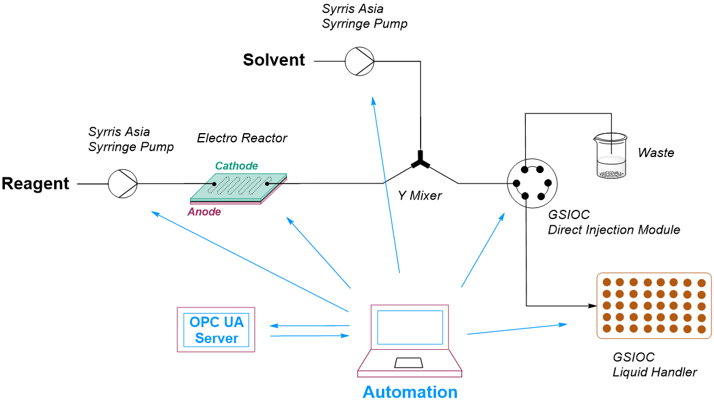

# auto_condition_screening
Python script for automated screening of electrochemical reaction conditions, utilizing Gilson Equipment, Syrris Asia pumps, and a BKPrecission Power Source. The communication is runing over OPC-UA, RS-232 and GSIOC.

# Get Started
Installation of modules

## run.py

## Experimental Parameters
What parameters can be set?

## "python run.py"
When running the main entry point from the root directory "auto_condition_screening/" like
```
python ./run.py
```
you get lead through a command line interface (CLI) to specify what you want to automate.

- Position change (y/n)

- Conduct experiments (y/n) from (int)

- Initialisation procedure (y/n)

# Architecture
About the structure of the script.


## Flow Diagram
Procedure for chemical experiments

## Flow Chemistry Setup Diagram
For which setup is the script concipated



## Network Diagram
This is how the script communicates with devices.


## File Structure
This is where you find the files.
```
auto_condition_screening
|---helper
|   |---analyzing_logg_file.py
|   |---auto_read.py
|   |---logging_decorator.py
|   |---process_killer.py
|   |---read_out_helper.py
|   |---stem4dplot.py
|
|---logs
|   |---general.log
|   |---monitoring.log
|   |---non_volatile_memory.txt
|   |---procedural_data.txt
|
|---tests
|   |---virtual_bkp_device.py
|   |---virtual_gsioc_device.py
|   |---virtual_syrrisasia_device.py
|
|---basic_gui.py
|---commands.py
|---documentation.py
|---duration_calculator.py
|---flow_setup.py
|---formatters.py
|---gsioc.py
|---immortility_decorator.py
|---LICENSE
|---monitor_BKP.py
|---protocol_power_supply.py
|---README.md
|---requirements.txt
|---run_identifier.py
|---run_syrringe_pump.py
|---run.py
|---sound.py
|---warden.py
```

## Moduel Description
What files contain what content?

## Requirements
This Software is tested only on WINDOWS OS, for operation of the Syrris Asia pumps it is expected to run their Syrris Asia Desktop application befor starting this script. For serial port emulation during testing it is recommended to use "32bit" 'Virtual Serial Ports Emulator (x32) 1.2.6.788'; free download available [here](https://eterlogic.com/Products.VSPE.html).

The following python packages need to be installed to run the script:
```
aiofiles==23.2.1
aiosqlite==0.20.0
annotated-types==0.6.0
anyio==4.3.0
asyncua==1.1.0
certifi==2024.2.2
cffi==1.16.0
charset-normalizer==3.3.2
click==8.1.7
colorama==0.4.6
comtypes==1.3.1
contourpy==1.2.0
cryptography==42.0.5
customtkinter==5.2.2
cycler==0.12.1
darkdetect==0.8.0
distro==1.9.0
et-xmlfile==1.1.0
exceptiongroup==1.2.0
fonttools==4.50.0
gTTS==2.5.1
h11==0.14.0
httpcore==1.0.4
httpx==0.27.0
idna==3.6
kiwisolver==1.4.5
loguru==0.7.2
lxml==5.1.0
matplotlib==3.8.3
numpy==1.26.4
opcua==0.98.13
openai==1.14.1
openpyxl==3.1.2
packaging==24.0
pandas==2.2.1
pillow==10.2.0
psutil==5.9.8
PyAudio==0.2.14
pycparser==2.21
pydantic==2.6.4
pydantic_core==2.16.3
pyOpenSSL==24.1.0
pyparsing==3.1.2
pypiwin32==223
pyserial==3.5
pyserial-asyncio==0.6
python-dateutil==2.9.0.post0
pyttsx3==2.90
pytz==2024.1
pywin32==306
regex==2023.12.25
requests==2.31.0
scipy==1.12.0
six==1.16.0
sniffio==1.3.1
sortedcontainers==2.4.0
tabulate==0.9.0
tqdm==4.66.2
typing_extensions==4.10.0
tzdata==2024.1
urllib3==2.2.1
win32-setctime==1.1.0
```