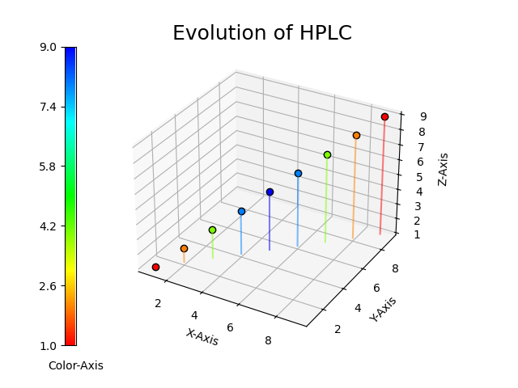
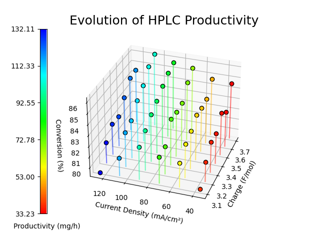
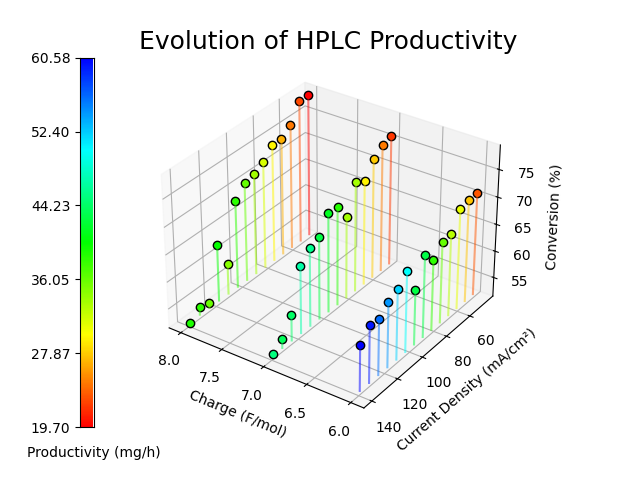
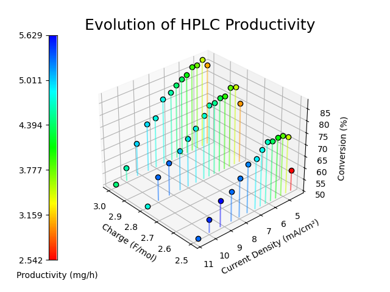
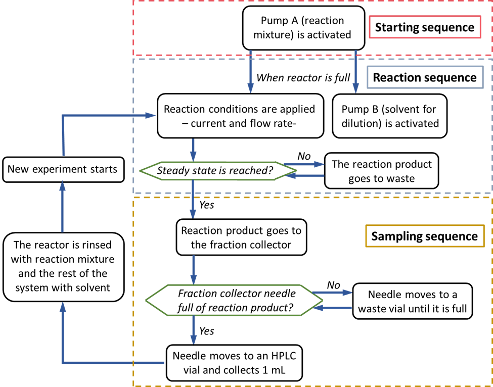

# auto_condition_screening
Python script for automated screening of electrochemical reaction conditions, utilizing Gilson Equipment, Syrris Asia pumps, and a BKPrecission Power Source. The communication is runing over OPC-UA, RS-232 and GSIOC.

This script is designed for automated experimental procedures in a laboratory environment. It encompasses various functionalities including liquid handling, syringe pumping, data monitoring, and user interaction. Additionally, there are provisions for starting watchdog processes and a graphical user interface (GUI). The main execution orchestrates the automation process, allowing for remote data retrieval and flexible experimentation. Overall, this script serves as a comprehensive tool for streamlining laboratory workflows and conducting experiments efficiently.

# Get Started

## Quick Start
from the root directory "auto_condition_screening/" run the following commands
```
pip install -r requirements.txt
python ./run.py
```
The system will prompt you 
```
starting position change? (y/n):
```
answering with "y" will start up the GUI for direct device interacitons.
answering with "n" will lead to another prompt
```
starting experiments (further settings are queried afterwards)? (y/n):
```
answering with "n" exits the script.
answering with "y" leads to the next prompt
```
from which experiment number do you want to start? (integer number)
```
provide an integer number to select the experiment to start with. The first experiment is number 1 (not 0). The last prompt will appear.
```
Do you want to carry out the initialisation procedure including filling the reactor? (y/n)
```
answering with "y" will fill the pumps and the system (reactor, tubings, etc.) with the prepared chemicals.
answering with "n" will skip this step and just start with the  experimental procedures.

## Experimental Parameters
Before starting the experimental parameters need to be set to your specific use case.
Therefore open the run.py file.

For Running experiments be sure to set and specify the ports properly.
```
TESTING_ACTIVE = False
```
Also be sure to set the proper endpoints for your ports and the OPC-UA Server
```
PORT1   = 'COM3'    #port for GX-241 liquid handler
PORT2   = 'COM4'    #port for BK Precision 1739
OPC_UA_SERVER_URL = "opc.tcp://127.0.0.1:36090/freeopcua/server/" 
```
(NOTE: The OPC_UA_SERVER_URL parameter has to be set for the GUI separately. Open therefore the "basic_gui.py" file and set this parameter there as well.)

The residual parameters can be set as demanded for the experiments.
One example to conduct three experiments in a row:
```
CURRENTS = [2.5, 2.7, 3.7]
CHARGE_VALUES = [2.5, 2.8, 2.5]
```
the residual parameters will be calculated automatically.
It is also possible to set other parameters, as long as they are not in conflict with each other.
For detailes see the Module Description below.
NOTE: all parameters have to be inputted as a list of parameters. the first of them is always specifying the first experiment, and so forth.

## Testing Modus with Virtual Devices
For testing purposes


## Plotting Data






## "python run.py"
When running the main entry point from the root directory "auto_condition_screening/" like
```
python ./run.py
```
you get lead through a command line interface (CLI) to specify what you want to automate.

- Position change (y/n)

- Conduct experiments (y/n) from (int)

- Initialisation procedure (y/n)

# Architecture
About the structure of the script.

## Flow Diagram
The following Procedure is carried out during the experiments.



## Flow Chemistry Setup and Network Diagram
The script is concipated for the following setup


## File Structure
This is where you find the files.
```
auto_condition_screening/
|
|---helper/
|   |---analyzing_logg_file.py
|   |---auto_read.py
|   |---logging_decorator.py
|   |---process_killer.py
|   |---read_out_helper.py
|   |---stem4dplot.py
|
|---logs/
|   |---general.log
|   |---monitoring.log
|   |---non_volatile_memory.txt
|   |---procedural_data.txt
|
|---tests/
|   |---virtual_bkp_device.py
|   |---virtual_gsioc_device.py
|   |---virtual_syrrisasia_device.py
|
|---basic_gui.py
|---commands.py
|---documentation.py
|---duration_calculator.py
|---flow_setup.py
|---formatters.py
|---gsioc.py
|---immortility_decorator.py
|---LICENSE
|---monitor_BKP.py
|---protocol_power_supply.py
|---README.md
|---requirements.txt
|---run_identifier.py
|---run_syrringe_pump.py
|---run.py
|---sound.py
|---warden.py
```

## Module Description

### run.py
The main experimental settings have to be set in here.
If some of these parameters are not set by the user, they will get calculated by the system.
```
TESTING_ACTIVE = True

PORT1   = 'COM3'    #port for GX-241 liquid handler - Ubuntu: '/dev/ttyUSB0'
PORT2   = 'COM4'    #port for BK Precision 1739 - Ubuntu: '/dev/ttyUSB1'

##### Adapt this URL to the desired OPC-UA endpoint #####
OPC_UA_SERVER_URL = "opc.tcp://127.0.0.1:36090/freeopcua/server/" # "opc.tcp://rcpeno02341:5000/" # OPC Server on new RCPE laptop # "opc.tcp://18-nf010:5000/" #OPC Server on FTIR Laptop # "opc.tcp://rcpeno00472:5000/" #OPC Server on RCPE Laptop

# Volumetric relation of substance in pump B to substance in pump A (float)
DILLUTION_BA = [] 
# Experimental Current in (mA)
CURRENTS = [5,15,30] 
# Flow rate of pump A (μL/min)
FLOW_A  = [] 
# Flow rate of pump B in (μL/min)
FLOW_B  = []
# Molar charge of the redox reaction in (F/mol)
CHARGE_VALUES = [3,2,2]
# Generates similar concentration values for each experiment, used in calculating the flow rates (float). 
CONCENTRATIONS = np.full(len(CURRENTS),(0.025)).tolist() 
# Faraday Constant in ((A*s)/mol)
FARADAY_CONST = constants.physical_constants['Faraday constant'][0] 
# Maximum flow rate of pump A (μL/min)
MAX_FLOWRATE_A = 2500 
# Maximum flow rate of pump B (μL/min)
MAX_FLOWRATE_B = 250 
# Operate on constant Flow Rate of pump A (float)
CONSTANT_A_FLOWRATE = MAX_FLOWRATE_A/3
# Rinsing factor to gain information about the reactors stady state (float)
STADY_STATE_RINSING_FACTOR = np.full(len(CHARGE_VALUES),(3)).tolist()
# Starting from experiment with this 1-based integer number (int)
CONDUCTION_FROM_EXP = int(1)
# Skipping the filling of the pumps (True/False)
SKIP_FILLING = False
```
#### Flow Setup variation
Changes at the setup can be done within this function.
```
get_automation_setup():
"""Sets up the flow setup specific parameters and initializes setup instances, ports and threads."""
```

#### Monitoring Power Supply
The Power Supply is queried constantly throughout the process to monitor its parameters. The parameters are logged in a file called "logs/monitoring.log". This is achieved via multithreading.
```
class CustomThread(threading.Thread):
    """Separate thread for querying BKPrecission Power Source parameters parallel to other operations."""
```

#### Watchdog
To increase process safety the process is overlooked via a warden process. This process ensures that the process runs to the end and restartes at the appropriate experiment if the process was killed unexpectedly.
```
def start_watchdog() -> None:
    """Runs the warden.py file for ensuring the main process is not killed arbitrary.
    :expects: the overall process is started from the same directory as "warden.py". Tested only on WINDOWS OS, python has to be on PATH.
    """
```

#### Graphical User Interface (GUI)
A simple GUI enables the operator to carry out some basic operations during setting up the flow setup. 
```
def start_gui() -> None:
    """Runs the GUI for basic commands towards the flow setup devices.
    :expects: the overall process is started from the same directory as "basic_gui.py". Tested only on WINDOWS OS, python has to be on PATH.
    """
```

## Requirements
This Software is tested only on WINDOWS OS, for operation of the Syrris Asia pumps it is expected to run their Syrris Asia Desktop application befor starting this script. For serial port emulation during testing it is recommended to use "32bit" 'Virtual Serial Ports Emulator (x32) 1.2.6.788'; free download available [here](https://eterlogic.com/Products.VSPE.html).

The following python packages need to be installed to run the script:
```
aiofiles==23.2.1
aiosqlite==0.20.0
annotated-types==0.6.0
anyio==4.3.0
asyncua==1.1.0
certifi==2024.2.2
cffi==1.16.0
charset-normalizer==3.3.2
click==8.1.7
colorama==0.4.6
comtypes==1.3.1
contourpy==1.2.0
cryptography==42.0.5
customtkinter==5.2.2
cycler==0.12.1
darkdetect==0.8.0
distro==1.9.0
et-xmlfile==1.1.0
exceptiongroup==1.2.0
fonttools==4.50.0
gTTS==2.5.1
h11==0.14.0
httpcore==1.0.4
httpx==0.27.0
idna==3.6
kiwisolver==1.4.5
loguru==0.7.2
lxml==5.1.0
matplotlib==3.8.3
numpy==1.26.4
opcua==0.98.13
openai==1.14.1
openpyxl==3.1.2
packaging==24.0
pandas==2.2.1
pillow==10.2.0
psutil==5.9.8
PyAudio==0.2.14
pycparser==2.21
pydantic==2.6.4
pydantic_core==2.16.3
pyOpenSSL==24.1.0
pyparsing==3.1.2
pypiwin32==223
pyserial==3.5
pyserial-asyncio==0.6
python-dateutil==2.9.0.post0
pyttsx3==2.90
pytz==2024.1
pywin32==306
regex==2023.12.25
requests==2.31.0
scipy==1.12.0
six==1.16.0
sniffio==1.3.1
sortedcontainers==2.4.0
tabulate==0.9.0
tqdm==4.66.2
typing_extensions==4.10.0
tzdata==2024.1
urllib3==2.2.1
win32-setctime==1.1.0
```