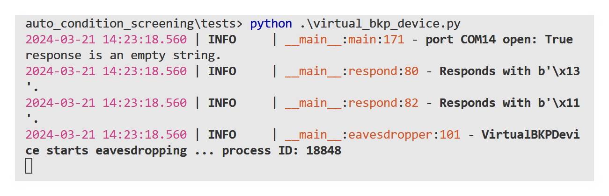

# auto_condition_screening
Python script for automated screening of electrochemical reaction conditions, utilizing Gilson Equipment, Syrris Asia pumps, and a BKPrecission Power Source. The communication is runing over OPC-UA, RS-232 and GSIOC.

This script is designed for automated experimental procedures in a laboratory environment. It encompasses various functionalities including liquid handling, syringe pumping, data monitoring, and user interaction. Additionally, there are provisions for starting watchdog processes and a graphical user interface (GUI). The main execution orchestrates the automation process, allowing for remote data retrieval and flexible experimentation. Overall, this script serves as a comprehensive tool for streamlining laboratory workflows and conducting experiments efficiently.

# Introduction
Get the source code [here](https://github.com/fungos34/auto_condition_screening).

Clone this repository to your local machine.

## Quick Start
from the root directory "auto_condition_screening/" run the following commands
```
pip install -r requirements.txt
python ./run.py
```
The system will prompt you 
```
starting position change? (y/n):
```
answering with "y" will start up the GUI for direct device interacitons.
answering with "n" will lead to another prompt
```
starting experiments (further settings are queried afterwards)? (y/n):
```
answering with "n" exits the script.
answering with "y" leads to the next prompt
```
from which experiment number do you want to start? (integer number)
```
provide an integer number to select the experiment to start with. The first experiment is number 1 (not 0). The last prompt will appear.
```
Do you want to carry out the initialisation procedure including filling the reactor? (y/n)
```
answering with "y" will fill the pumps and the system (reactor, tubings, etc.) with the prepared chemicals.
answering with "n" will skip this step and just start with the  experimental procedures.

## Flow Diagram
The following Procedure is carried out during the experiments.


## Experimental Parameters
The possibility to set all experimental parameters gives you full flexibility to modify the experiments to your specific needs.

Therefore before running the script, the experimental parameters need to be set properly to your specific use case.
Therefore open the run.py file.

For Running experiments be sure to set and specify the ports properly.
```
TESTING_ACTIVE = False
```
Also be sure to set the proper endpoints for your ports and the OPC-UA Server
```
PORT1   = 'COM3'    #port for GX-241 liquid handler
PORT2   = 'COM4'    #port for BK Precision 1739
OPC_UA_SERVER_URL = "opc.tcp://127.0.0.1:36090/freeopcua/server/" 
```
(NOTE: The OPC_UA_SERVER_URL parameter has to be set for the GUI separately. Open therefore the "basic_gui.py" file and set this parameter there as well.)

The residual parameters can be set as demanded for the experiments.
One example to conduct three experiments in a row:
```
CURRENTS = [2.5, 2.7, 3.7]
CHARGE_VALUES = [2.5, 2.8, 2.5]
```
the residual parameters will be calculated automatically.
It is also possible to set other parameters, as long as they are not in conflict with each other.
For detailes see the Module Description below.
NOTE: all parameters have to be inputted as a list of parameters. the first of them is always specifying the first experiment, and so forth.

## Logging

Logging throughout automated chemical experiments is important for several reasons:

1. **Data Integrity**: Logging allows for the collection of detailed records of experimental parameters, reactions, and outcomes. This ensures the integrity of the experimental data, enabling researchers to analyze results accurately and reproduce experiments if necessary.

2. **Quality Control**: By logging every step of the experiment, researchers can monitor the process in real-time and identify any deviations or anomalies promptly. This facilitates quality control and troubleshooting, ensuring that experiments proceed as planned and reducing the risk of errors or failures.

3. **Documentation and Reproducibility**: Comprehensive logging provides a documented history of the experiment, including procedures, conditions, and observations. This documentation is essential for reproducibility, enabling other researchers to replicate the experiment and verify the results independently.

4. **Analysis and Optimization**: Logged data can be analyzed to identify patterns, trends, and correlations that may not be apparent during the experiment. This analysis can help researchers optimize experimental conditions, refine protocols, and improve the efficiency and effectiveness of future experiments.

5. **Regulatory Compliance**: In regulated environments such as pharmaceutical research or chemical manufacturing, logging is necessary to comply with industry standards and regulations. Detailed logs ensure traceability and accountability, demonstrating adherence to regulatory requirements and facilitating audits or inspections.

Overall, logging throughout automated chemical experiments is essential for maintaining data integrity, ensuring quality control, documenting procedures, enabling reproducibility, facilitating analysis and optimization, and complying with regulatory standards. By capturing detailed records of experimental processes and outcomes, logging enhances the reliability, transparency, and rigor of scientific research in the field of chemistry.

### Logging Sinks
For reproducibility all the communication between the devices is monitored and stored in a file located at 
"auto_condition_screening/logs/general.log"

For reliability of the current and voltage values of the power source are monitored throughout the whole process separately in a file at the location 
"auto_condition_screening/logs/monitoring.log"

Furthermore the watchdog maintains its own file at the location. This monitores process crash during the conduction of the experiments. Please note, that if the process has been restarted all the other loggings will be written to this file too.
"auto_condition_screening/logs/watchdog.log"

## Testing Modus with Virtual Devices

Testing with virtual devices offers several advantages in the context of automated chemical experiments:

1. **Cost-Effectiveness**: Virtual devices eliminate the need for physical hardware, saving costs associated with purchasing and maintaining laboratory equipment. This is particularly beneficial for researchers with budget constraints or those exploring experimental setups before investing in actual devices.

2. **Flexibility and Scalability**: Virtual devices provide flexibility to simulate various experimental conditions and scenarios without constraints imposed by physical limitations. Researchers can easily scale up or modify experiments virtually, allowing for rapid prototyping and iteration.

3. **Accessibility**: Virtual devices are accessible from any location with an internet connection, enabling remote experimentation and collaboration. Researchers can conduct experiments, share results, and collaborate with colleagues worldwide without being confined to a specific laboratory.

4. **Risk Reduction**: Testing with virtual devices minimizes the risk of accidents, equipment damage, or exposure to hazardous substances associated with physical experimentation. Researchers can explore experimental setups and parameters safely in a virtual environment before conducting experiments in the laboratory.

5. **Time Efficiency**: Virtual experimentation enables rapid iteration and testing of hypotheses without waiting for physical setup or execution. Researchers can streamline the experimental process, accelerate data collection, and expedite the overall research timeline.

6. **Debugging and Validation**: Virtual devices facilitate debugging and validation of automated processes by providing detailed feedback and error logs. Researchers can identify and address issues more efficiently, ensuring the reliability and robustness of automated systems before deployment in the laboratory.

7. **Training and Education**: Virtual devices serve as valuable educational tools for training students and researchers in experimental techniques and laboratory procedures. They offer a risk-free environment for hands-on learning and skill development in a wide range of scientific disciplines.

Overall, testing with virtual devices offers numerous advantages, including cost-effectiveness, flexibility, accessibility, risk reduction, time efficiency, debugging capabilities, and educational benefits. Integrating virtual experimentation into the research workflow enhances productivity, innovation, and collaboration in the field of automated chemical experiments.

### Running Virtual Devices

For testing and development purposes this script comes with virtual devices. Running these virtual devices mimics the response behaviour of the real devices.

to start them open a new commandline window (on WINDOWS: press "Windows Key" and type "cmd", press "Enter") change directory to your root directory and "auto_condition_screening/tests/". From here run the following command
```
python ./virtual_bkp_device.py      # alternatively run "virtual_gsioc_device.py" or "virtual_syrrisasia_device.py"
``` 



You can change the port on which these virtual devices are listening within the respective files.

## Plotting Data
For Data visualisation a helper module has been implemented. 
To use it, change to the directory "auto_condition_screening/helper/".
In the file "stem4dplot.py" you can use the class Stem4DPlot() to plot your data.

practical example:
```
Stem4DPlot(
    [1,2,3,4,5,6,7,8,9,'X-Axis'],
    [1,2,3,4,5,6,7,8,9,'Y-Axis'],
    [1,2,3,4,5,6,7,8,9,'Z-Axis'],
    [1,2,4,8,9,8,4,2,1,'Color-Axis'],
    color_code='none',
    reverse_colors=False,
    lower_colorscale_border=None,
    upper_colorscale_border=None
    )

```
running this file now yields the following plot:


With more complex data results may look like this:


# Architecture
About the structure of the script.


## Flow Chemistry Setup and Network Diagram
The script is concipated for the following setup


## File Structure
The overall file structure looks like this.
```
auto_condition_screening/
|---docs/
|   |--- (... images ...) 
|
|---helper/
|   |---analyzing_logg_file.py
|   |---auto_read.py
|   |---logging_decorator.py
|   |---process_killer.py
|   |---read_out_helper.py
|   |---stem4dplot.py
|
|---logs/
|   |---general.log
|   |---monitoring.log
|   |---non_volatile_memory.txt
|   |---procedural_data.txt
|
|---tests/
|   |---virtual_bkp_device.py
|   |---virtual_gsioc_device.py
|   |---virtual_syrrisasia_device.py
|
|---basic_gui.py
|---commands.py
|---documentation.py
|---duration_calculator.py
|---flow_setup.py
|---formatters.py
|---gsioc.py
|---immortility_decorator.py
|---LICENSE
|---monitor_BKP.py
|---protocol_power_supply.py
|---README.md
|---requirements.txt
|---run_identifier.py
|---run_syrringe_pump.py
|---run.py
|---sound.py
|---warden.py
```

## Module Description

### run.py
To run the script the main experimental settings have to be set in here.
If some of these parameters are not set by the user, they will get calculated by the system.
```
TESTING_ACTIVE = True

PORT1   = 'COM3'    #port for GX-241 liquid handler - Ubuntu: '/dev/ttyUSB0'
PORT2   = 'COM4'    #port for BK Precision 1739 - Ubuntu: '/dev/ttyUSB1'

##### Adapt this URL to the desired OPC-UA endpoint #####
OPC_UA_SERVER_URL = "opc.tcp://127.0.0.1:36090/freeopcua/server/" 

# Volumetric relation of substance in pump B to substance in pump A (float)
DILLUTION_BA = [] 

# Experimental Current in (mA)
CURRENTS = [5,15,30] 

# Flow rate of pump A (μL/min)
FLOW_A  = [] 

# Flow rate of pump B in (μL/min)
FLOW_B  = []

# Molar charge of the redox reaction in (F/mol)
CHARGE_VALUES = [3,2,2]

# Generates similar concentration values for each experiment, used in calculating the flow rates (float). 
CONCENTRATIONS = np.full(len(CURRENTS),(0.025)).tolist() 

# Faraday Constant in ((A*s)/mol)
FARADAY_CONST = constants.physical_constants['Faraday constant'][0] 

# Maximum flow rate of pump A (μL/min)
MAX_FLOWRATE_A = 2500 

# Maximum flow rate of pump B (μL/min)
MAX_FLOWRATE_B = 250 

# Operate on constant Flow Rate of pump A (float)
CONSTANT_A_FLOWRATE = MAX_FLOWRATE_A/3

# Rinsing factor to gain information about the reactors stady state (float)
STADY_STATE_RINSING_FACTOR = np.full(len(CHARGE_VALUES),(3)).tolist()

# Starting from experiment with this 1-based integer number (int)
CONDUCTION_FROM_EXP = int(1)

# Skipping the filling of the pumps (True/False)
SKIP_FILLING = False
```
#### Flow Setup variation
Changes at the setup can be done within this function.
```
get_automation_setup():
"""Sets up the flow setup specific parameters and initializes setup instances, ports and threads."""
```

#### Monitoring Power Supply
The Power Supply is queried constantly throughout the process to monitor its parameters. The parameters are logged in a file called "logs/monitoring.log". This is achieved via multithreading.
```
class CustomThread(threading.Thread):
    """Separate thread for querying BKPrecission Power Source parameters parallel to other operations."""
```

#### Watchdog
To increase process safety the process is overlooked via a warden process. This process ensures that the process runs to the end and restartes at the appropriate experiment if the process was killed unexpectedly.
```
def start_watchdog() -> None:
    """Runs the warden.py file for ensuring the main process is not killed arbitrary.
    :expects: the overall process is started from the same directory as "warden.py". Tested only on WINDOWS OS, python has to be on PATH.
    """
```

#### Graphical User Interface (GUI)
A simple GUI enables the operator to carry out some basic operations during setting up the flow setup. 


```
def start_gui() -> None:
    """Runs the GUI for basic commands towards the flow setup devices.
    :expects: the overall process is started from the same directory as "basic_gui.py". Tested only on WINDOWS OS, python has to be on PATH.
    """
```

## Requirements
This Software is tested only on WINDOWS OS, for operation of the Syrris Asia pumps it is expected to run their Syrris Asia Desktop application befor starting this script. For serial port emulation during testing it is recommended to use "32bit" 'Virtual Serial Ports Emulator (x32) 1.2.6.788'; free download available [here](https://eterlogic.com/Products.VSPE.html).

The following python packages need to be installed to run the script:
```
aiofiles==23.2.1
aiosqlite==0.20.0
annotated-types==0.6.0
anyio==4.3.0
asyncua==1.1.0
certifi==2024.2.2
cffi==1.16.0
charset-normalizer==3.3.2
click==8.1.7
colorama==0.4.6
comtypes==1.3.1
contourpy==1.2.0
cryptography==42.0.5
customtkinter==5.2.2
cycler==0.12.1
darkdetect==0.8.0
distro==1.9.0
et-xmlfile==1.1.0
exceptiongroup==1.2.0
fonttools==4.50.0
gTTS==2.5.1
h11==0.14.0
httpcore==1.0.4
httpx==0.27.0
idna==3.6
kiwisolver==1.4.5
loguru==0.7.2
lxml==5.1.0
matplotlib==3.8.3
numpy==1.26.4
opcua==0.98.13
openai==1.14.1
openpyxl==3.1.2
packaging==24.0
pandas==2.2.1
pillow==10.2.0
psutil==5.9.8
PyAudio==0.2.14
pycparser==2.21
pydantic==2.6.4
pydantic_core==2.16.3
pyOpenSSL==24.1.0
pyparsing==3.1.2
pypiwin32==223
pyserial==3.5
pyserial-asyncio==0.6
python-dateutil==2.9.0.post0
pyttsx3==2.90
pytz==2024.1
pywin32==306
regex==2023.12.25
requests==2.31.0
scipy==1.12.0
six==1.16.0
sniffio==1.3.1
sortedcontainers==2.4.0
tabulate==0.9.0
tqdm==4.66.2
typing_extensions==4.10.0
tzdata==2024.1
urllib3==2.2.1
win32-setctime==1.1.0
```